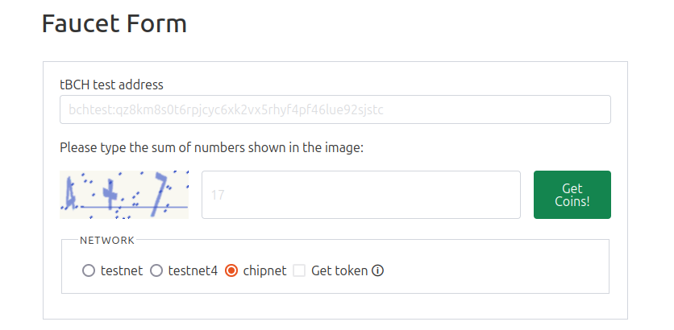

# Welcome to OPTN Wallet

Welcome to the OPTN Wallet project! OPTN Wallet is a cutting-edge cryptocurrency wallet designed for secure and efficient transactions. Visit our [website](https://optn-website.vercel.app/) for more information.

## Testnet Faucet

To get testnet coins from Chipnet, navigate to Network under the Settings tab and click on the link. Paste your address and make sure to select "chipnet"



## Developer Quick Start

To get started with the development of the OPTN Wallet, follow the steps below:

### Repository

The source code for the OPTN Wallet is hosted on GitHub. You can find the repository at the following link:
[GitHub Repository](https://github.com/BitcoinBay/OPTNWallet)

### Local Development Build

1. **Clone the Repository**

   ```bash
   git clone https://github.com/BitcoinBay/OPTNWallet.git
   cd OPTNWallet
   ```

2. **Install Dependencies**

   ```bash
   npm install
   ```

3. **Run Development Server**
   ```bash
   npm run dev
   ```

### Building the App for Android / iOS

1. **Initialize Capacitor**

   ```bash
   npm run capacitor:init
   ```

2. **Add Android Platform**

   ```bash
   npm run capacitor:add:android
   ```

3. **Copy Web Assets**

   ```bash
   npm run capacitor:copy
   ```

4. **Sync Capacitor Plugins**

   ```bash
   npm run capacitor:sync
   ```

5. **Open Android Studio**

   ```bash
   npm run capacitor:open:android
   ```

6. **Build the Project**
   - For Android: Use Android Studio to build and run the project on an emulator or a physical device.
   - For iOS: Open the `ios` folder in Xcode and build the project.

### Available Scripts

- **Start Development Server:** `npm run dev`
- **Build for Production:** `npm run build`
- **Lint the Code:** `npm run lint`
- **Preview the Production Build:** `npm run preview`
- **Format the Code:** `npm run format`
- **Serve the Production Build:** `npm run serve`

## Contribution & Contact

We welcome contributions from the community! Join our [Telegram Group](https://t.me/+KLBMsVW0xHY1YWI5) to connect with the developers and other contributors.

Thank you for your interest in the OPTN Wallet project!
